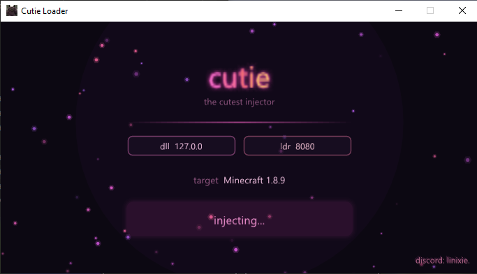
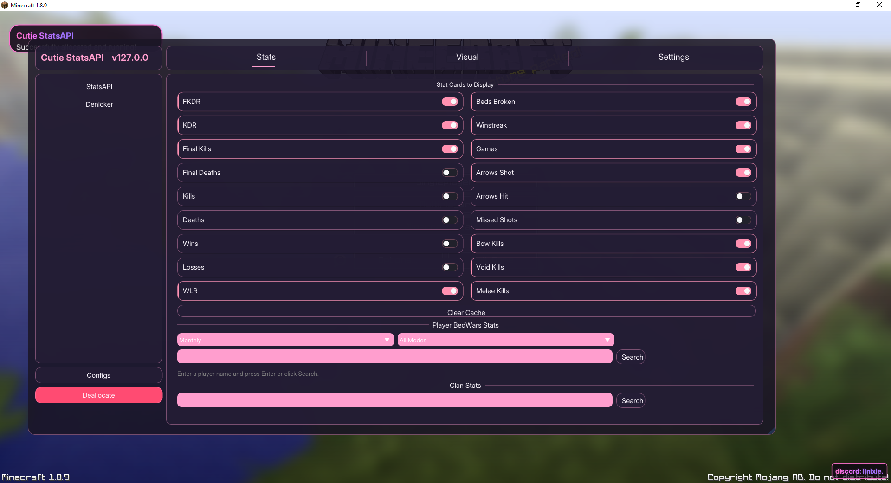
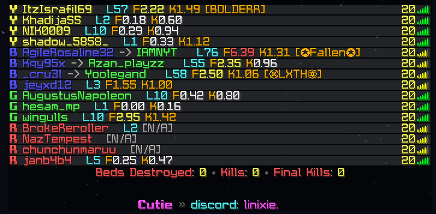
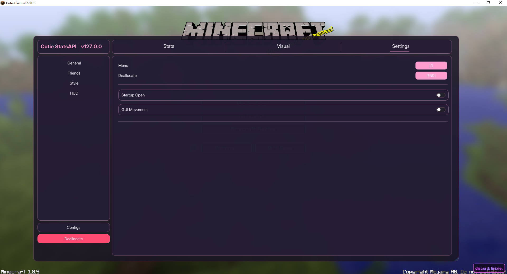
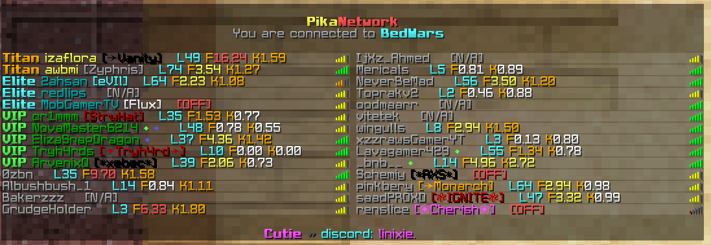

# Cutie-Loader & Stats API

A high-performance statistics integration and modular overlay for PikaNetwork. This project provides both a standalone loader interface and the raw modification DLL.

## Core Features
- **Statistics Integration**: Real-time stats calculation displayed directly in-game.
- **Tablist Enhancements**: Dynamic modifications to the network tablist.
- **Modular ClickGUI**: Easy configuration of features, stats API endpoints, and visual overlays.
- **Embedded Injection Engine**: Self-contained manual mapping loader with zero configuration needed.

## Setup & Loading Options

The release package includes both `cutie-loader.exe` and `cutie.dll`. You can load the modification using either method:

### Option 1: Standalone Loader (Recommended)
1. Download `cutie-loader.exe`.
2. Launch the game client.
3. Run `cutie-loader.exe`. It will automatically initialize, unpack the embedded DLL/configs, and inject them. *(No Administrator privileges required.)*

### Option 2: Custom Injection
1. Download `cutie.dll` from the latest release.
2. Use any standard DLL injector (e.g., Process Hacker, Cheat Engine, or a custom manual mapper).
3. Inject `cutie.dll` into the game process.

---

## How to Add Your Own Screenshots
To replace the image placeholders in this README, simply name your screenshots as follows and upload them to the root folder of this repository:
- **Main Loader Preview**: name it `loader_preview.png`
- **ClickGUI Preview**: name it `clickgui_preview.png`
- **Tablist Injection Preview**: name it `tablist_injection_preview.png`
- **Settings Preview**: name it `settings_preview.png`
- **Stats Tablist Preview**: name it `stats_display_preview.png`

Alternatively, you can upload them to a directory (like `images/`) and update the paths at the bottom or top of this file.

---

## Previews & Interface

### In-Game ClickGUI & Stats API Config

### Tablist Modification Injection

### Features & Display Settings

### Live Stats Tablist Display

---

## Developer Support
For inquiries, bug reporting, or custom integration support:
- **Discord**: `linixie.`
