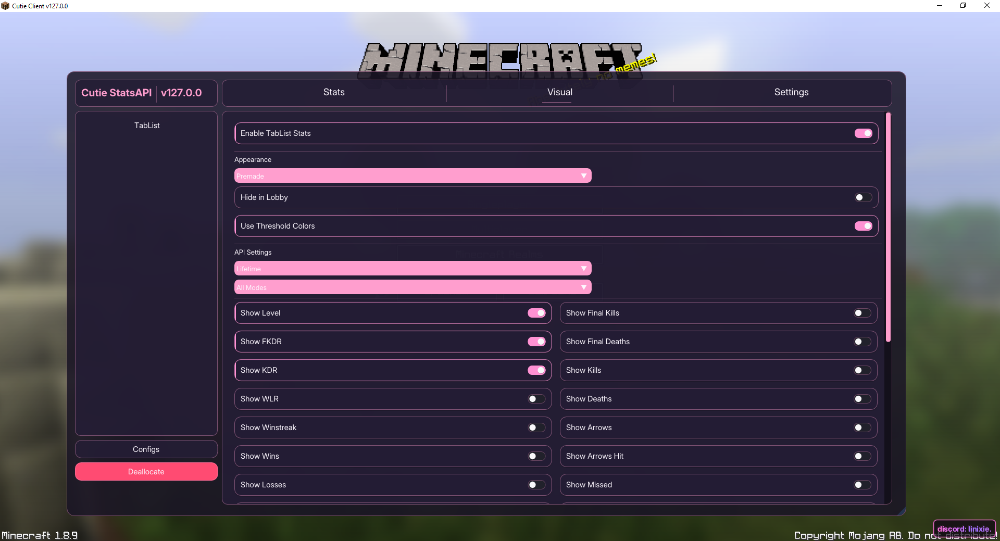

# Cutie - PikaNetwork Internal Stats API

Cutie is an internal stats modification for Minecraft 1.8.9. Instead of drawing external screen overlays on top of your game, Cutie renders statistics directly inside the native Minecraft tab list.


## Supported Clients (1.8.9)
Cutie is built for **Minecraft 1.8.9** and natively supports:  

-  **Vanilla**
-  **Forge**
-  **Lunar Client** (OptiFine & Forge profiles)
-  **Badlion Client**
-  **LabyMod** (Vanilla & Forge)

*Note: Other 1.8.9 clients may work, but the ones listed above are fully tested.*

---

## Setup & Loading Options

You can load Cutie using the standalone loader executable or inject the DLL manually using your own injector.

### Option 1: Standalone Loader (Recommended)
1. Download `cutie-loader.exe` from the latest release.
2. Launch your Minecraft client and join a world or server.
3. Open `cutie-loader.exe`. It will automatically unpack the internal DLL and inject it.

### Option 2: Manual DLL Injection
1. Download `cutie.dll` from the release assets.
2. Inject `cutie.dll` into your game process using any standard 64-bit injector (e.g. Process Hacker).

---

##  Antivirus False Positives

Because the loader reads game memory and injects code into Minecraft (which is required for the allocation to work), **Windows Defender or other antivirus software may falsely flag `cutie-loader.exe` as malware and delete it.** The standalone `cutie.dll` is much less likely to trigger this, but if you are using the loader, you may need to whitelist it.

**Quick Fix for Windows Defender:**
1. Create a dedicated folder for the loader (for example: `C:\Cutie`).
2. Open Windows PowerShell as **Administrator**.
3. Copy, paste, and run the following command to automatically exclude that folder from Defender scans:
   ```powershell
   Add-MpPreference -ExclusionPath "C:\Cutie"
4. Download and place `cutie-loader.exe` into that newly excluded folder and run it.

---

## Logs & Troubleshooting

If you run into injection issues, crashes, or rendering bugs:
- **Loader Logs**: Saved in the folder where `cutie-loader.exe` was executed.
- **DLL Logs**: Saved at `%userprofile%\.cutie\log.txt`.

---

## Tablist Status Indicators

When viewing stats in-game or via the tab list:
- **NICK**: Player is using a nickname or disguise.
- **OFF**: Stats module is toggled off for that player or category.
- **N/A**: Player stats are unavailable (e.g., brand-new account with 0 stats).

---

## Previews

| In-Game ClickGUI | Display Settings |
| :---: | :---: |
|  |  |
| **Tablist Modification Injection** | **Stats API Module Configuration** |
|  |  |

### Live Stats Tablist Display


---

## Support
For bugs or questions, reach out on Discord: `linixie.`

---

### Credits & Acknowledgements
- [](https://github.com/nlohmann/json) **[nlohmann/json](https://github.com/nlohmann/json)** - JSON for Modern C++. 
- [](https://github.com/ocornut/imgui) **[Dear ImGui](https://github.com/ocornut/imgui)** - Bloat-free Immediate Mode Graphical User Interface for C++ with minimal dependencies.
- [](https://github.com/DarthTon/Blackbone) **[Blackbone](https://github.com/DarthTon/Blackbone)** - Windows memory hacking library for process interaction and manual mapping.
- [](https://github.com/YuriSizuku/OnscripterYuri) **[ONScripter-Yuri](https://github.com/YuriSizuku/OnscripterYuri)** - An enhanced ONScripter project porting to many platforms.
